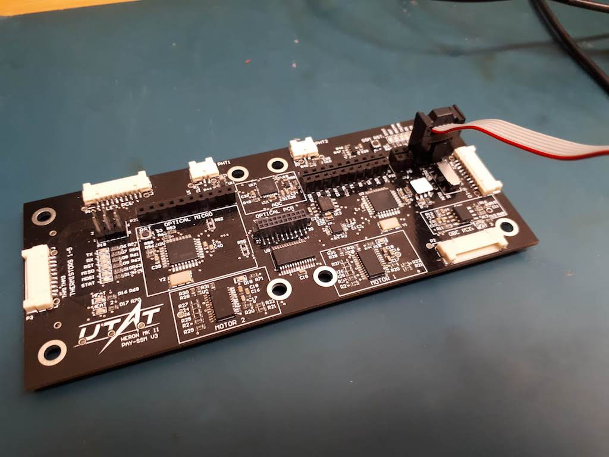
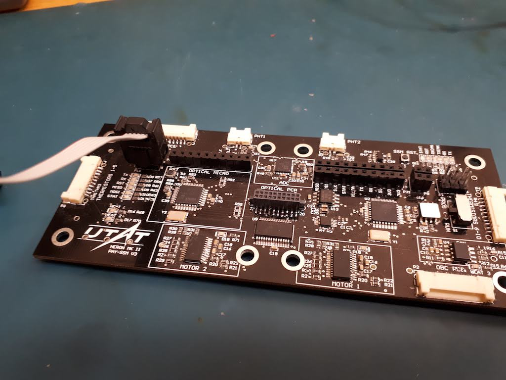
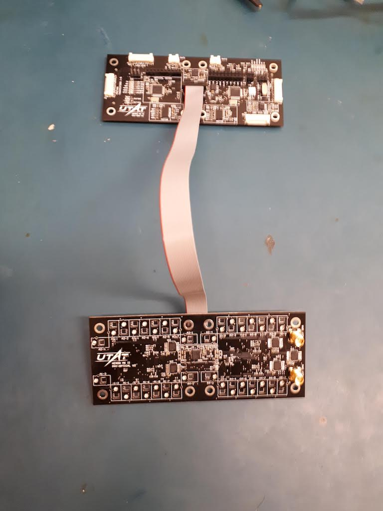
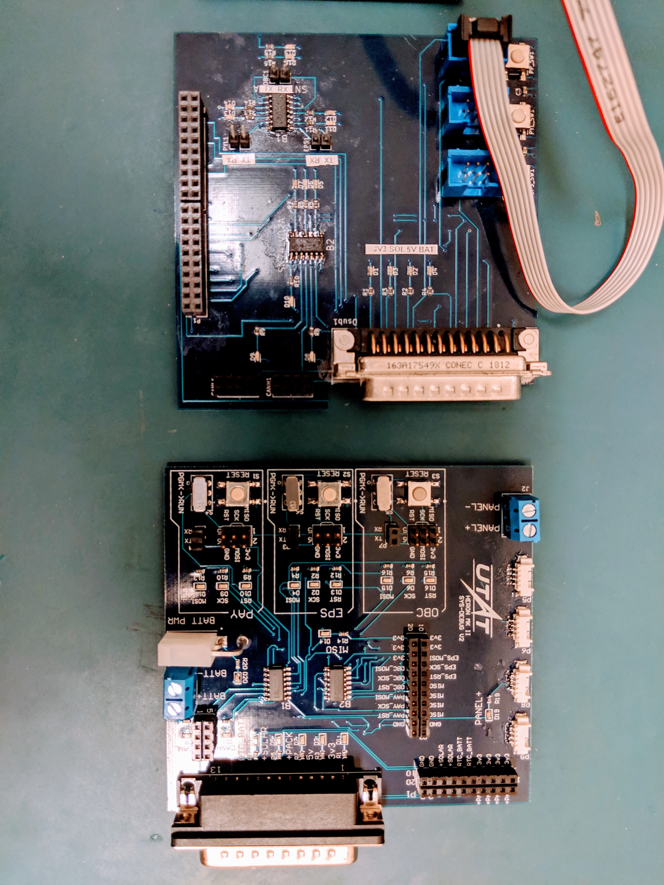

# Printed Circuit Boards (PCBs)
This repository houses circuits and PCB design for the Heron MK II cubesatellite project.
https://github.com/HeronMkII/pcbs/issues
**Export all schematics and board layouts to PDF files so others can easily view them without using Altium.**

**Use the Issues tab in this repository to track any hardware/electrical issues, suggestions for PCBs, or other items related to electronics.**


## Updating pcbs-common

From the `pcbs` folder:

`$ git submodule update --remote`

This will fetch the latest commit of `pcbs-common` and update your files.

If you get an error about having modified files inside the `pcbs-common` folder, run the following:

```
$ cd pcbs-common
$ git reset --hard
```

This will discard all local changes you have made in the `pcbs-common` folder. Then, run `$ git submodule update --remote` again to download the most updated version of the `pcbs-common` files.


## Current PCBs in Lab

### PAY-SSM

[Manufacturing notes](https://github.com/HeronMkII/pcbs/issues/14)

Programming PAY-SSM microcontroller:


Programming PAY-Optical microcontroller:


- **Programming headers - for both, the notch on the connector must face DOWN**
    - Board orientation is determined by the UTAT logo
- **Contains two microcontrollers:**
    - **PAY-SSM (right side)**
        - Controls SSM functions
        - Need to set switch to PROG when uploading programs, and RUN when executing programs
        - Switch must be in RUN mode for SSM_RST button and UART to work
        - Can leave microcontroller's RX pin connected when uploading a program (commands from a laptop)
    - **PAY-Optical (left side)**
        - Controls optical sensor setup
        - Should be on the PAY-Optical board, but is on the SSM board due to space constraints
        - UART headers (from MCU's perspective) - TX (DI, for printing, more common), RX (CLK, for commands, less common)
        - Need to disconnect RX (CLK) pin when uploading a program
- Payload subsystem main board
- Controls motors, heaters, thermistors
- Interfaces with EPS/OBC on the CAN bus
- 10-pin DF-14 connector to EPS
- 2x2 header on right side between long debugging header and programming header - top 2 pins are MCU's TX (prints), bottom 2 pins are MCU's RX (laptop commands)
- Careful of different 5V and 3V3 headers!!
- 5V supply required if using motors and heaters
- The two microcontrollers are connected to each other over SPI, where PAY-SSM functions as the master and PAY-Optical functions as the slave
- If the PAY-Optical MCU doesn't program properly, the PAY-SSM MCU might be interfering by sending SPI messages to it - either upload an empty program to the PAY-SSM MCU or hold down the SSM_RST button when programming the PAY-Optical MCU
- Disconnected (desoldered) CONFIG pin on both motor drivers so they use phase/enable mode


### PAY-Optical

[Manufacturing notes](https://github.com/HeronMkII/pcbs/issues/15)

Connecting PAY-SSM PCB to PAY-Optical PCB (if using 20-pin cable for debugging instead of stacking header pins):


- Payload optical board
- Physically stacked on top of PAY-SSM with a 20-pin header
    - Bought a 20-pin wire for testing without having to stack the boards
- 34 optical sensors and 2 SMA connectors to test input by simulating the input signal after the first amplification stage
- MCU for optical setup is located on the PAY-SSM PCB


### PAY-LED

[Manufacturing notes](https://github.com/HeronMkII/pcbs/issues/20)

- Payload LED board
- Contains LEDs on opposite side from PAY-Optical board
- Second copy currently (on 2018-09-18) being soldered by Cindy
- Each LED board has a 10-pin DF14 connector to PAY-SSM


### BUS (OBC/EPS/COMM)

- Combined onboard computer, electrical power systems, and communications on the same board
- Next iteration will have OBC on its own board, EPS/COMM still together on the other board
- Decided to not finish soldering a complete board with all components, just a couple of partially finished boards
- Connects to systems PCB with DSUB-25 connector
- Two MCUs: EPS and OBC
- Must program MCUs through the systems debug PCB


### Systems Debug PCB

- Systems debugging board
- Connects to EPS board with DSUB-25 connector
- Will allow us to plug in the single DSUB-25 cable to the satellite, program and view UART from any board/MCU, and monitor high-level debugging signals
- The following picture shows the v1 (on the left) and v2 (on the right) Systems Debug PCB. V2 has all the components soldered on and is ready to be used. Potential issues and changes are documented in Issue [#70](https://github.com/HeronMkII/pcbs/issues/70)



## Old PCBs in Lab

### OBC-001

### OBC-002

### PAY-SSM
- Not all components soldered
- Previously used to test conformal coating
